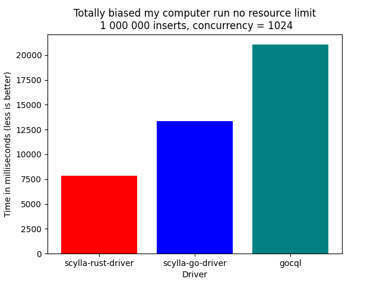
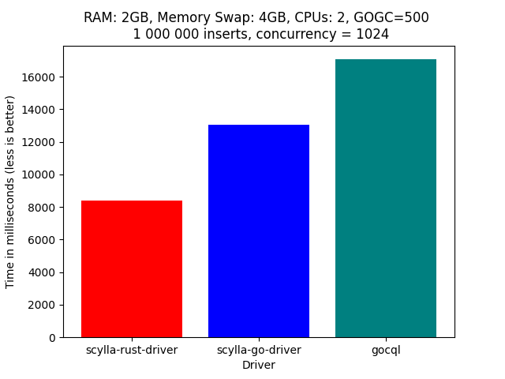

# Rust driver benchmarks
Benchmarks for Scylla Golang Driver

## Benchmarks

## Drivers:
* `scylla-go-driver` - [Scylla Go driver](https://github.com/mmatczuk/scylla-go-driver)
* `scylla-rust-driver` - [Scylla Rust driver](https://github.com/scylladb/scylla-rust-driver)
* `gocql` - A [driver written in Go](https://github.com/gocql/gocql)

## How to run a benchmark
Each benchmark is inside a Docker image  
Build the image and run the benchmark  
Most commands require `sudo` or being in the docker group

For example to run the `basic` benchmark using `scylla-rust-driver`
* Start a local scylla instance: `sudo ./scylla.sh`
* Enter benchmark directory: `cd benchmarks/basic/rust`
* Build the benchmark: `sudo ./build.sh`
* Wait until scylla is ready (Should say something like `listening on 172.17.0.3`)
* Run the benchmark: `sudo ./run.sh`

## How to generate a result chart
Chart generator is also in a docker image for convenience

* Enter the `generate_chart` directory
* Build the docker image: `sudo ./build.sh`
* Enter benchmark results in `config.py`
* Generate the chart: `sudo ./generate.sh`
* Generated chart will be in `chart.png`
